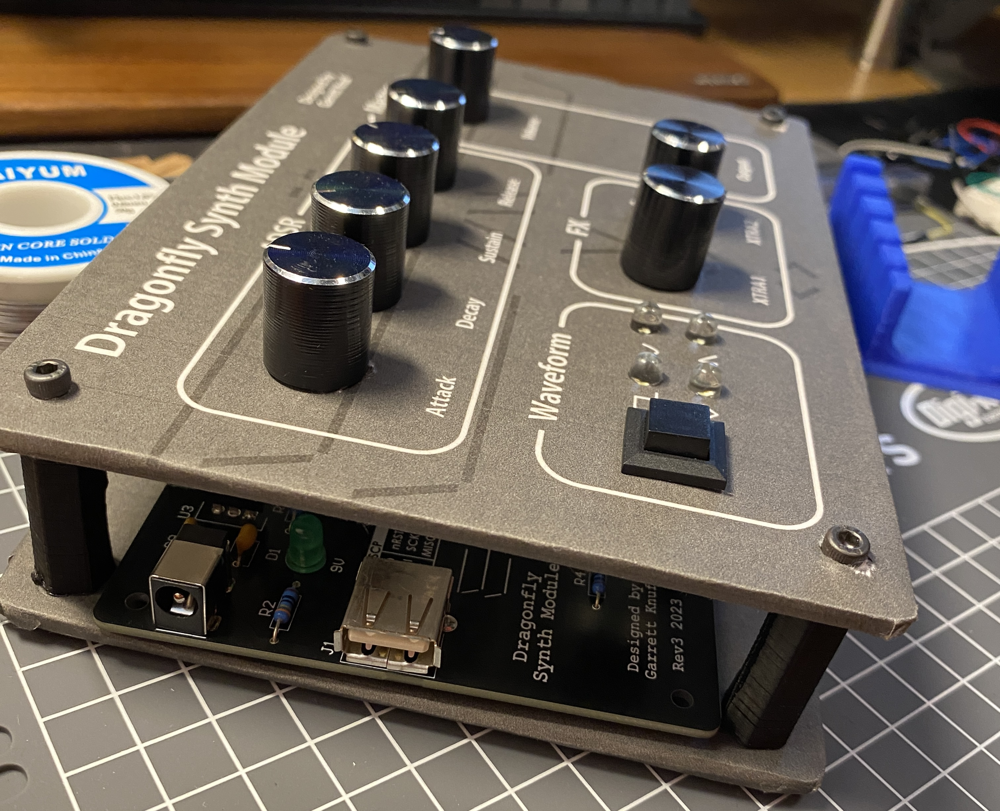

## User Interface
* LEDs - indicates status of system (i.e., current waveform being generated)
* Push buttons - sets shape of waveform
* Potentiometers - modifies ADSR amplitude envelope controls
* DAC - sets audio output to generate waveform
* USB - reads keypresses via UART

## Waveform Generation
The software for the Dragonfly Synthesizer Module is an event-driven architecture. Timer peripherals of AVR microcontroller generate interrupts handle button debouncing, ADC reading, UART communications, and waveform sampling.

The DAC is updated every 25 microseconds yielding a 40 kHz sampling rate. It has 8-bit resolution (256 values). The microcontroller must compute the next sample within 400 clocks (25 us) to ensure that the next sample matches the desired waveform.

The system of capable of computing square, sine, triangle, and sawtooth waveforms. Once the sample corresponding to the frequency is generated, it is then scaled to match the ADSR (attack, decay, sustain, release) envelope.

