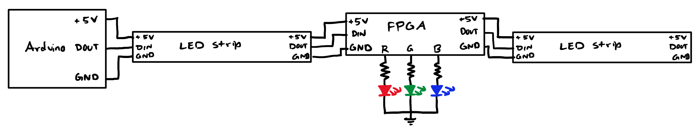
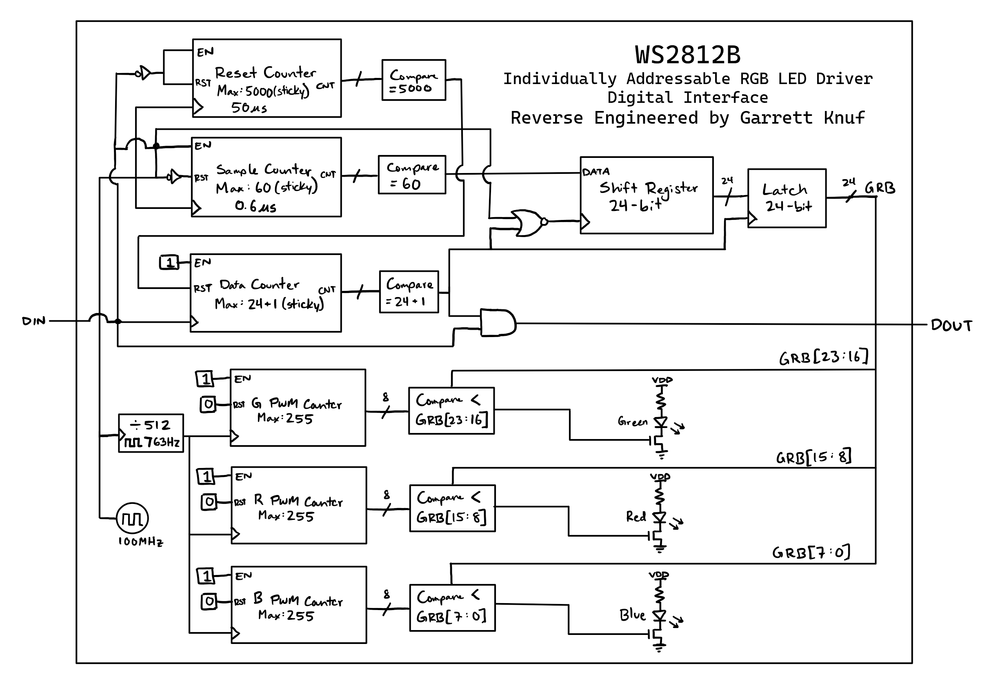

Individually Addressable RGB LED Driver Digital Interface
  
Reverse-engineered from [WS2812B Datasheet](https://cdn-shop.adafruit.com/datasheets/WS2812B.pdf)

View source files at [Github Code Repository](https://github.com/garrettknuf/WS2812B-Digital-Design/tree/master)

<b>What makes this project unique?</b> 
Unlike other WS2812b drivers found online, this code emulates the behavior of a WS2812b instead of controlling one.
Other drivers for this ICs are made with the objective of setting different RGB values to LEDs strip in different patterns
while this project is an attempt to reverse-engineer to WS2812b itself and how the digital interface might appear inside the IC.

## Test Setup
* Arduino sends commands through `DIN` to WS2812B ICs
* ICs are connected in a cascade, receiving data on `DIN` and transmitting data on `DOUT`
* Basys 3 Artix-7 FPGA connected on daisy chain to emulate WS2812B behavior

## Digital Interface Architecture
* Implemented in Verilog with an Basys 3 Artix-7 FPGA
* FPGA uses 100 MHz internal clock for system timing
  

